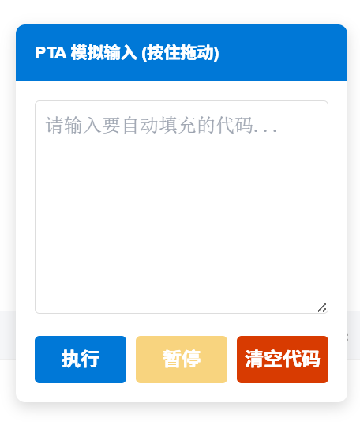

# PTAPasteBypass

## 🧩 项目简介

一个基于油猴（Tampermonkey）的脚本，用于**模拟键盘输入行为**，从而绕过 PTA 平台的粘贴限制。

相比直接粘贴，本脚本通过逐字符输入，使代码看起来像“手动输入”，提升可用性与灵活性。

---

## ✨ 新版本特性（main.beta.js）

当前已提供增强版本 👉 **`main.beta.js`**，支持以下新功能：

* ⏸️ **可暂停模拟输入**

  * 在输入过程中可随时暂停，方便调整或检查代码

* 🧹 **一键清空编辑框**

  * 快速清除当前代码，无需手动删除

* ⚡ **更流畅的输入体验**

  * 优化输入逻辑，减少卡顿与异常

👉 推荐优先使用 **beta 版本** 进行体验

---

## 🎬 演示 Demo

> 点击执行输入后，需要点击两次代码编辑框哦

---

## 🚀 使用方法

1. 安装油猴插件（Tampermonkey）
2. 导入脚本（推荐使用 `main.beta.js`）
3. 打开 PTA 代码编辑页面
4. 点击脚本按钮执行模拟输入

---

## ⚠️ 注意事项

* 部分页面可能需要**手动点击编辑框两次**以激活输入
* 输入速度受浏览器性能和代码长度影响
* 若出现异常，可尝试刷新页面重新执行

---

## 📢 免责声明

1. 本项目中的油猴脚本仅用于**技术研究与学习交流**，用于探索浏览器脚本及网页交互机制。
2. 使用本脚本绕过网站粘贴限制的行为，**可能违反相关网站的用户协议或使用规范**。
3. 因使用该脚本产生的任何后果（包括但不限于账号限制、封禁等），**均由使用者自行承担**。
4. 请在合法合规前提下使用技术工具，尊重平台规则与知识产权。
5. 本项目作者不对因使用或滥用本项目所造成的任何直接或间接损失承担责任。

---

## ⭐ 说明

如果你觉得这个项目有帮助，可以点个 Star 支持一下！

---

