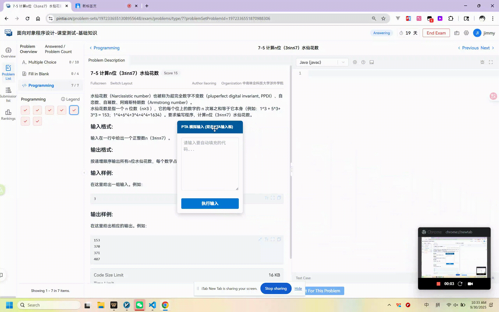

# PTAPasteBypass

一个面向 Pintia / PTA 的 Tampermonkey 脚本集合，核心思路是把“直接粘贴”转换为“模拟输入”，尽量绕过代码编辑器中的粘贴限制。

## 推荐版本

当前主推脚本：**`pintia-paste-optimized.user.js`**

这个版本更适合日常使用：

- 直接接管编辑器内的粘贴事件，复制代码后可直接粘贴
- 自动识别 Pintia 的 `.cm-content` 编辑区域
- 按分块模拟输入，兼顾稳定性和输入流畅度
- 自动统一换行符，减少 Windows 剪贴板带来的额外空行问题
- 无需额外悬浮面板，安装后即可使用

如果你只想安装一个版本，优先选择它。

## 文件说明

| 文件                             | 定位 | 说明                                           |
| -------------------------------- | ---- | ---------------------------------------------- |
| `pintia-paste-optimized.user.js` | 推荐 | 自动拦截粘贴并改为模拟输入，最省事             |
| `pintia-paste-enhanced.user.js`  | 备选 | 面板增强版，支持暂停、继续、停止重来、清空代码 |
| `pintia-paste-basic.user.js`     | 备选 | 面板基础版，保留最早的手动执行输入方案         |
| `demo.gif`                       | 演示 | 项目整体使用演示                               |
| `beta-demo.png`                  | 截图 | 增强版面板示意图                               |

## 使用方法

### 方式一：推荐使用优化版

1. 安装 Tampermonkey
2. 导入 `pintia-paste-optimized.user.js`
3. 打开 Pintia 代码编辑页面
4. 聚焦到代码编辑器后，直接粘贴代码即可

### 方式二：使用面板版

1. 导入 `pintia-paste-enhanced.user.js` 或 `pintia-paste-basic.user.js`
2. 在脚本面板中粘贴代码
3. 点击执行，并按提示选中目标编辑器

## 演示

增强版面板示意：

## 注意事项

- 仅在 `https://pintia.cn/*` 下生效
- 代码较长时，模拟输入需要一定时间，这是预期行为
- 如果页面结构变动，编辑器选择器可能需要同步调整
- 面板版在部分页面中仍可能需要手动点击目标编辑器

## 免责声明

1. 本项目仅用于技术研究与学习交流。
2. 使用脚本绕过网站限制，可能违反目标网站的用户协议或使用规范。
3. 由使用本项目产生的任何后果，均由使用者自行承担。
4. 请在合法合规前提下使用，并尊重平台规则与知识产权。
